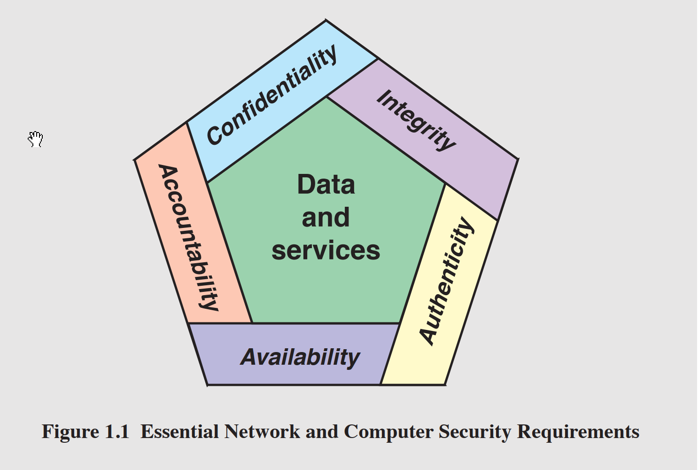
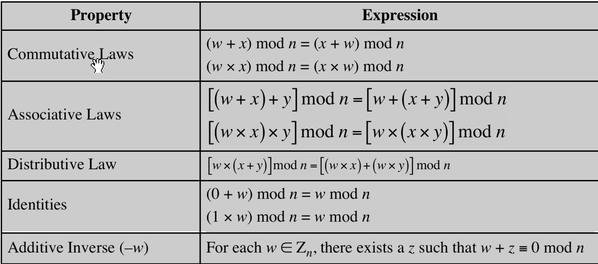
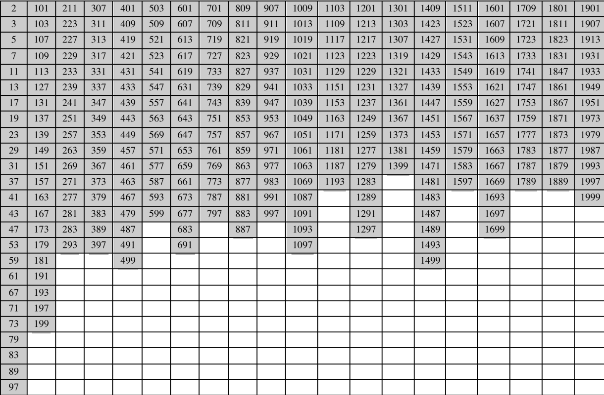
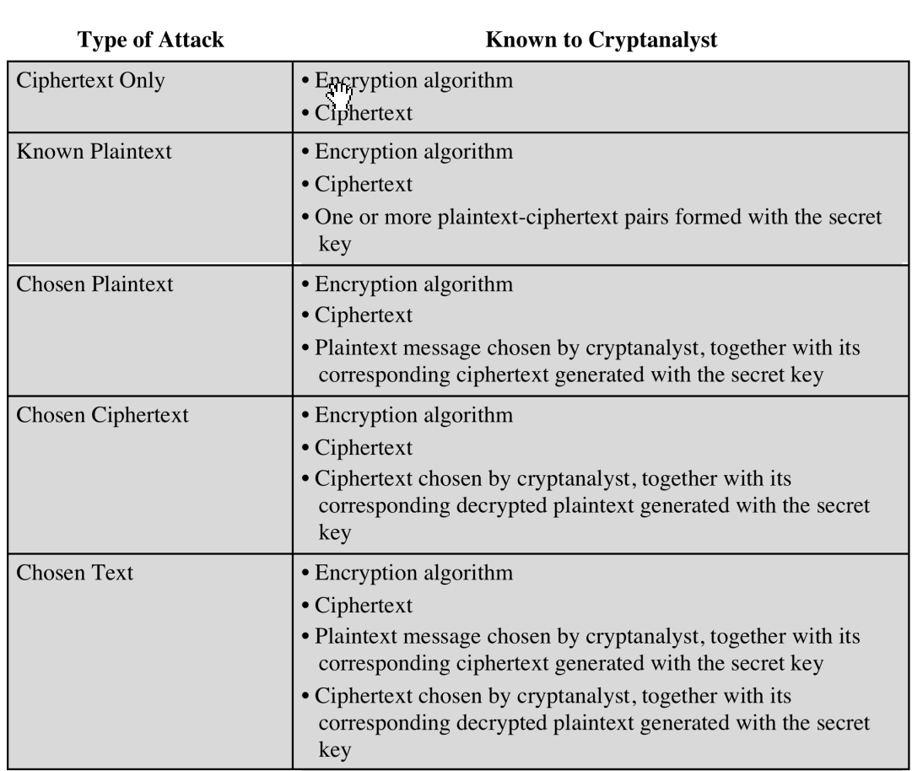

## Network security and Reliability

Encryption mechanisms and how to break systems

## Cryptographic algorithms
* Symmetric
  * Conceal the contents of blocks or streams of data of any size (messages, files, encryption keys, passwords)
* Asymetric
  * Conceal small blocks of data, (encryption keys and hash function values)
* Data Integrity
  * Protect blocks of data
* Authentication protocols
  * Schemas based on the use of cryptographic algorithms designed to authenticate identity of entities
  
### Security
The protection afforded to an automated information system in order to attain the applicable objectives of preserving the integrity, availability and confidentiality ofinformation system resources”
(includes hardware, software, firmware, information/data, and telecommunications)

### Objectives
* Confidentiality
* Integrity
* Availability

### Levels of impact [Adverse effect on organizational operations,assets or idnividuals]
* High - Catastrophic
* Moderate - Serious
* Low - Limited

## References
- NIST Computer Security Handbook

## OSI Security Architecture
* Security Attack
* Security Mechanism
* Security Service

## Attacks
[Threats and attacks RFC4949](https://tools.ietf.org/html/rfc4949)
* Passive
  * Sniffing, listening, eavesdropping
*  Active
   * Masquerade [Entity impersonation ] 
   * Replay [Passive data capture,retransmission to produce unauthorized effect ] 
   * Modification of messages [Message alteration ] 
   * Denial of Service [Prevents or inhibits normal use of management of communication facilities ] 
### Attack surface
Reachable and exploitable vulnerabilities in a system (Open ports, outward facing web and other servers, code listening on ports, SQL, Firewakk serrvucesm social engineering attack)
#### Categories
* Network attack surface. 
  * Vulnerabilities over an enterprise network, wide-area network, or the Internet
* Software attack surface
    Vulnerabilities in application, utility, or operating system code
* Human attack surface
  * Vulnerabilities created by personnel or outsiders


#### Attack Tree
* A branching, hierarchical data structure that represents a set of potential techniques for exploiting security vulnerabilities
* The security incident that is the goal of the attack is represented as the root node of the tree, and the ways that an attacker could reach that goal are represented as branches and subnodes of the tree 
* The final nodes on the paths outward from the root, (leaf nodes), represent different ways to initiate an attack
* The motivation for the use of attack trees is to effectively exploit the information available on attack patterns

* Communication interruption [Availability]
* Eavesdropping [Confidentiality]
* Info Mofification  [Integrity]
* Fabrication

### Authentication
* Peer entity
* Data origin

### Access Control
* Limit and control the access to hos systems and applications via communication links
### Data Confidentiality
* Protection of transmitted data from passive attacks
* Protection of traffic flow fromanalysis
### Data Integrity
* Apply to a stream of messages, singe or seleted fields within a message
* Connection-oriented integrity,service 
### Non repudation
* Prevents denial of authorship
* Proves sender and receiver identity
### Availability Service
* Protects system to ensure its availability
* Addresses the secuirty concerns raised by denial-of-service attacks
* Proper nmanagement and control of system resources, depends on access control serice and other security services
  
#### Specific Security Mechanisms
* Encipherment
* Digital signatures
* Access controls
* Data integrity
* Authentication exchange
* Traffic padding
* Routing control
* Notarization
#### Pervasive Security Mechanisms
* Trusted functionality
* Security labels
* Event detection
* Security audit trails
* Security recovery

### Security Design principles
* Economy of mechanism
  * Design of security measures embodied in both hardware and software should be as simple and small as possible
  * Relatively simple, small design is easier to test and verify thoroughly
  * With a complex design, there are many more opportunities for an adversary to discover subtle weaknesses to  exploit that may be difficult to spot ahead of time
* Fail-safe defaults
  * Access decisions should be based on permission ratherthan exclusion
  * Default situation = lack of access, and the protection scheme identifies conditions under which access is permitted
  * Most file access systems and virtually all protected services on client/server use fail-safe defaults
* Complete mediation
  * Every access must be checked against the access control mechanism
  * Systems should not rely on access decisions retrieved from a cache
  * Every time a user reads a field or record in a file, or a data item in a database, the system must exercise access control
  * This resource-intensive approach is rarely used
* Open design
  * Design of a security mechanism should be open rather than secret
  * Although encryption keys must be secret, encryption algorithms should be open to public scrutiny
  * Is the philosophy behind the NIST [NIST: National Institute of Standards and Technology](http://www.nist.gov)
program of standardizing encryption
and hash algorithms
* Separation of privilege
  *  Defined as a practice in which multiple privilege attributes arerequired to achieve access to a
restricted resource 
  * Multifactor user authentication is an example which requires the use of multiple techniques, such as a
password and a smart card, to authenticate a user
* Least privilege
  * Means that every process and every user of the system should operate using the least set of privileges necessary to perform the task
  * An example of the use of this principle is role-based access control; the system security policy
can identify and define the various roles of users or processes and each role is assigned only those
permissions needed to perform its functions
* Least common mechanism
  * Means that the design should minimize the functions shared by different users, providing mutual security
  * This principle helps reduce the number of unintended communication paths and reduces the amount of hardware and
software on which all users depend, thus making it easier to verify if there are any undesirable security implications
* Psychological acceptability
  * Implies that the security mechanisms should not interfere unduly with the work of users, while at the same time
meeting the needs of those who authorize access
  * Where possible, security mechanisms should be transparent to the users of the system or, at most, introduce minimal obstruction
  * In addition to not being intrusive or burdensome, security procedures must reflect the user’s mental model of protection
* Isolation
  * Public access systems should be isolated from critical resources to prevent disclosure or tampering
  * Processes and files of individual users should be isolated from one another except where it is explicitly desired
  * Security mechanisms should be isolated in the sense of preventingaccess to those mechanisms
* Encapsulation
  * Can be viewed as a specific form of isolation based on object-oriented functionality
  * Protection is provided by encapsulating a collection of procedures and data objects in a domain of its own so that the internal structure of a data object is accessible only to the procedures of the protected subsystem, and the procedures may be called only at designated domain entry points
* Modularity
  * Refers both to the development of security functions as separate, protected modules and to the use of a modular architecture for mechanism design and implementation
* Layering
  * Refers to the use of multiple, overlapping protection approaches addressing the people, technology, and operational aspects of information systems
  * The failure or circumvention of any individual protection approach will not leave the system unprotected
* Least astonishment
* A program or user interface should always respond in the way that is least likely to astonish the user
* The mechanism for authorization should be transparent enough to a user that the user has a good intuitive
understanding of how the security goals map to the provided security mechanism


#### National Institute of Standards and Technology
* ISOC is a professional membership society with world-wide organizational and individual membership
* Provides leadership in addressing issues that confront the future of the Internet and is the organization home for
the groups responsible for Internet infrastructure standards
#### Internet Society
* The International Telecommunication Union (ITU) is an international organization within the United Nations
System in which governments and the private sector coordinate global telecom networks and services
* The ITU Telecommunication Standardization Sector (ITU-T) is one of the three sectors of the ITU and whose
mission is the development of technical standards covering all fields of telecommunications
#### ITU-T
* The International Organization for Standardization is a world-wide federation of national standards bodies from
more than 140 countries
* ISO is a nongovernmental organization that promotes the development of standardization and related activities
with a view to facilitating the international exchange of goods and services and to developing cooperation in the
spheres of intellectual, scientific, technological, and economic activity


## Number Theory
* Divisibility [A divides B A|B with integer result]
* Greatest Common Divisor GCD
* Moddulo
  * Congruent Modulo written as $(a mod n) \equiv (b mod n)$
### Modular arithmetic
1. [(a mod n) + (b mod n)] mod n = (a + b) mod n
2. [(a mod n) - (b mod n)] mod n = (a - b) mod n
3. [(a mod n) * (b mod n)] mod n = (a * b) mod n

#### Exponentiation by repeated multiplication
* $11^2 = 121 \equiv 4(mod 13)$
* $11^4 = (11^2)^2 \equiv 4^2(mod 13)$
* $11^7 = 11 x 11^2 x 11^4$
* $11^7 = 11 x 4 x 3 \equiv 132 \equiv 2 (mod 13)$


## Greatest Common Divisor GCD
**Relative primes**  = only common positive integer factor =  1
a and b are relatively prime if gcd(a,b) = 1


### Euclidean algorithm
* Determine GCD of two positive integers
710 = 2 x **310** + 90
**310** = 3 x **90** + 40
**90** = 2 x **40** + 10
**40** = 4 x **10**

```python
def euclid(a,b):
  return a if b = 0 else euclid(b, a % b)
```

### Prime Numbers
* Divided by 1 and itself
* Central to number theory
* Any integer a > 1 can be factored in a unique way as $a = p_1^{a_1} *  p_2^{a_2}  * p_3^{a_3}* p_n^{a_n}$ where:
  * $p_1 , p_2$ are prime numbers $a_i$ is positive integer 
  * 
### Fermat's theorem
* If p is prime and a is positive integer not divisible by p then $a^{p-1} \equiv 1(mod)p$
* $a^p \equiv a(mod)p$
### Euler's Totient Function $\phi (n)$
* For every a and n that are relatively prime $a^{\phi(n)}\equiv 1(mod n)$
* $a^{\phi(n)+1}\equiv a(mod n)$
### Miller-Rabin algorithm
Used to test large number for primality
TEST (n)
1. Find integers k, q, with k > 0, q odd, so that (n – 1)=2kq
2. Select a random integer a, 1 < a < n – 1
3. if aq mod n = 1 then return (“inconclusive")
4. for j = 0 to k – 1 
   1. if (a(2^j)*q mod n = n – 1) then return (“inconclusive")
5. return (“composite")

### Deterministic Primality Algorithm
* Prior to 2002 there was no known method of efficiently proving the primality of very large numbers
* All of the algorithms in use produced a probabilistic result 
* In 2002 Agrawal, Kayal, and Saxena developed an algorithm that efficiently determines whether a given large number is prime **(AKS algorithm)**
* Does not appear to be as efficient as the Miller-Rabin algorithm

### Chinese Remainder Theorem (CRT)
* Believed to have been discovered by the Chinese mathematician Sun-Tsu in around 200 A.D.
* One of the most useful results of number theory
  * Is possible to reconstruct integers in a certain range from their residues modulo a set of pairwise relatively prime moduli
* Provides a way to manipulate (potentially very large) numbers mod M in terms of tuples of smaller numbers
  * This can be useful when M is 150 digits or more
  * <span style="color:red">It is necessary to know beforehand the factorization of M</span>

### Discrete logarithm
$b \equiv a^i(mod p)$ where $0 \leq i \leq (p-1)$
This is referred to as the discrete logarithm of the number b for the base a(mod p)

## Classical encryption techniques
* **Plaintext** An original message
* **Ciphertext** The coded message
* **Enciphering/encryption** Converting from plaintext to ciphertext
* **Deciphering/decryption** Restoring the plaintext from the ciphertext
* **Cryptography** The area of study of the many schemes used for encryption
* **Cryptographic system/cipher** A scheme
  * The type of operations used for transforming plaintext to ciphertext
    * Substitution (block cipher) (Letter replacement by numbers, letters or symbols, replace plain text bit pattern with ciphertext bit patterns)
      * Types
        * Caesar cipher
          * Used by Julius Caesar [Replacing alphabet letters for others]
          * $c=E(3,p)=(p+3)mod(26)$
          * $C=E(k,p)=(p+k) mod(26)$
          * Decrption: $p=D(k,p)=(c-k) mod(26)$
        * Monoalphabetic Cipher
          * Permutation of a finite set of elements S in an ordered sequence of all the elements of S , with
each element appearing exactly once
          * If the “cipher” line can be any permutation of the 26 alphabetic characters, then there are 26! or greater than 4 x 1026 possible keys
          * This is 10 orders of magnitude greater than the key space for DES
          * Approach is referred to as a monoalphabetic substitution cipher because a single cipher alphabet is used per message
            * Plain Code:  abcdefghijklmnopqrstuvwxyz
            * Cipher Code: DKVQFIBJWPESCXHTMYAUOLRGZN
            * Plaintext:    ifwewishtoreplaceletters
            * Ciphertext:   WIRFRWAJUHYFTSDVFSFUUFYA
          * [Unsafe due to language characteristics and patterns](http://pi.math.cornell.edu/~mec/2003-2004/cryptography/subs/frequencies.html)
            * Most common english letters: E,T,R,N,I,O,A,S
            * Rare english letters: Z,J,K,Q,X
            * Digram - Trigram
        * Playfair cipher
          * Best-known multiple-letter encryption cipher
          * Treats digrams in the plaintext as single units and translates these units into ciphertext digrams
          * Based on the use of a 5 x 5 matrix of letters constructed using a keyword 
          * Invented by British scientist Sir Charles Wheatstone in 1854
          * Used as the standard field system by the British Army in World War I and the U.S. Army and other Allied forces during World War II
        * Hill Cipher
          * Strength is that it completely hides single-letter frequencies
          * The use of a larger matrix hides more frequency information 
          * A 3 x 3 Hill cipher hides not only single-letter but also two-letter frequency information
          * Strong against a ciphertext-only attack but easily broken with a known plaintext attack
        * Polyalphabetic Ciphers
        * Polyalphabetic substitution cipher
          * Improves on the simple monoalphabetic technique by using different monoalphabetic substitutions as one proceeds through the plaintext message
          * All these techniques have the following features in common:
            * A set of related monoalphabetic substitution rules is used
            * A key determines which particular rule is chosen for a given transformation
        * Vigenère Cipher
          * Best known and one of the simplest polyalphabetic substitution ciphers
          * In this scheme the set of related monoalphabetic substitution rules consists of the 26 Caesar ciphers with shifts of through 25
          * Each cipher is denoted by a key letter which is the ciphertext letter that substitutes for the plaintext letter
          * key is multiple letters long K = k1 k2 ... kd 
          * ith letter specifies ith alphabet to use
          * use each alphabet in turn
          * repeat from start after d letters in message
          * decryption simply works in reverse
        * One-Time Pad [PErfect Secrecy]
          * Improvement to Vernam cipher proposed by an Army Signal Corp officer, Joseph Mauborgne
          * Use a random key that is as long as the message so that the key need not be repeated
          * Key is used to encrypt and decrypt a single message and then is discarded
          * Each new message requires a new key of the same length as the new message
          * Scheme is unbreakable
              * Produces random output that bears no statistical relationship to the plaintext
              * Because the ciphertext contains no information whatsoever about the plaintext,
there is simply no way to break the code
      * Types
        * Symmetric,
        * single-key,
        * secret-key,
        * conventional encryption
    * Transposition (Stream cipher)
      * Rail Fence Cipher
        * Plaintext is written down as a sequence of diagonals and then read off as a sequence of rows
        * To encipher the message “meet me after the toga party” with a rail fence of depth 2, we would write:
        * m e m a t r h t g p r y
        * e t e f e t e o a a t
        * Encrypted message is: MEMATRHTGPRYETEFETEOAAT
      * Row Transposition cipher
        * Write message row by row and read it col by col by permuting column order
        * Product Ciphers
          * Substitution ciphers insecure because of language characteristics
          * Better use severa ciphers in succession (Substitution + Transposition) Bridge tomodern ciphers
      * Rotor Machines WW2
        * Enigma, Gagelin, Purple
      * Asymmetric, two-key, or public-key encryption
    * Steganography
      * Hide Existence of message
* **Cryptanalysis** Techniques used for deciphering a message without any knowledge of the enciphering details
  * Attack relies on the nature of the algorithm plus some knowledge of the general characteristics of the plaintext
  * Attack exploits the characteristics of the algorithm to attempt to deduce a specific plaintext or to deduce the key being used
* **Brute-force attack**
  * Attacker tries every possible key on a piece of ciphertext until an intelligible translation into plaintext is obtained
  * Half of all possible keys must be tried to achieve success
  * To supplement the brute-force approach, some degree of knowledge about the expected plaintext is needed, and some means of automatically distinguishing plaintext from garble is also needed
* **Cryptology** The areas of cryptography and cryptanalysis

### Symmetric Cipher Model
* There are two requirements for secure use of conventional encryption:
  * A strong encryption algorithm
  * Sender and receiver must have obtained copies of the secret key in a secure fashion and must keep the key secure


### Encryption Scheme Security 
* Unconditionally secure
  * No matter how much time an opponent has, it is impossible to decrypt the ciphertext because the required information is not there
* Computationally secure 
  * The cost of breaking the cipher exceeds the value of the encrypted information
  * The time required to break the cipher exceeds the useful lifetime of the information